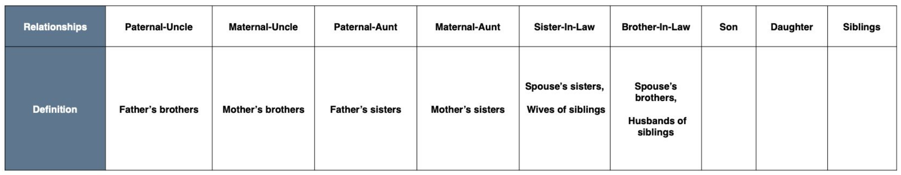

# Family Tree Algorithm

This files in this repositiory has been updated with the solution to the problem below.


Our problem is set on the planet of Lengaburu, the
distant galaxy of Tara B. Our protagonists are King
Arthur, Queen Margaret and their family.
## CLI APPLICATION OBJECTIVES

Write code to model out the King Arthur family tree so that:

* Given a ‘name’ and a ‘relationship’, you should output the people corresponding to the relationship
in the order in which they are added to the family tree
* You should be able to add a child to any family in the tree through the mother

## RELATIONSHIPS TO HANDLE

There are many relationships that could exist but at a minimum, your code needs to handle these
relationships.



## CHECKLIST - SUBMITTING CODE
1. Please open a Pull Request against this repository.
2. Replace this README with pertinent information.
3. Please include only source files and do not include any libraries or executables or
node_modules folder.

## SOLUTION

The application is written using *Python 3.8.5*. The entry file into the application is **shippit.py**. A shapshot of the folder structure is shown below. The application director contains a folder **lib** which contains the input files for the application. There are two input files:
* initialization.txt --> This file contains the initialization file required to build the planet of Lengaburu family tree as-is. The application will run the commands in this file on startup. This should not be modified by the user.
* instruction.txt --> This file constains the instruction file. that should be supplied by the user. Sample instruction below are included in this file:
  ```
  GET_RELATIONSHIP remus Maternal-Aunt
  GET_RELATIONSHIP william Paternal-Uncle
  GET_RELATIONSHIP draco Maternal-Uncle
  GET_RELATIONSHIP william Paternal-Aunt
  GET_RELATIONSHIP ted Brother-In-Law
  GET_RELATIONSHIP alice Sister-In-Law
  GET_RELATIONSHIP albus Son
  GET_RELATIONSHIP rose Daughter
  GET_RELATIONSHIP bill Siblings
  GET_RELATIONSHIP remus Siblings
  ```
### INSTRUCTION TO RUN
```
#Note: Kindly supply names in 'lowercase' for this application.
python3 shippit.py ./lib/instruction.txt
```

* See sample snapshot of application below


### APPLICATION FOLDER STRUCTURE
```
backend-challenge_odunet
├─ .gitignore
├─ README.md
├─ assets
├─ lib
│  ├─ initialization_DONT_MODIFY.txt
│  └─ instruction.txt
├─ package
│  ├─ __init__.py
│  ├─ familyTree.py
│  ├─ gender.py
│  └─ person.py
├─ requirements.txt
├─ shippit.py
└─ tests
   ├─ __init__.py
   ├─ integration
   │  ├─ __init__.py
   │  ├─ instruction.txt
   │  └─ shippit_test.py
   └─ unit
      ├─ __init__.py
      ├─ familyTree_test.py
      └─ person_test.py
```
### TEST
* Integration Test --> python3 -m unittest discover -s './tests/integration' -p '*_test.py'
* Unit Test --> python3 -m unittest discover -s './tests/unit' -p '*_test.py'
### DEPENDENCIES

* Python 3.8.5 (+)
